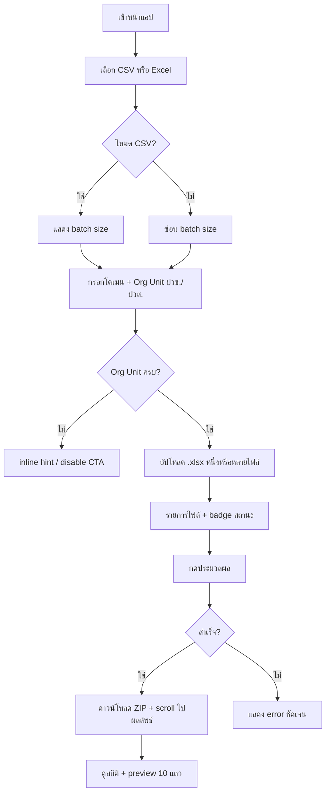

# UX Improvement Plan — Student Data Export

เอกสารอ้างอิงสำหรับ wireframe และ backlog ปรับ UX/UI ของ [student-export-web](https://jaobie-bn.github.io/student-export-web/)

---

## 1. Wireframe — สถานะปัจจุบัน (As-Is)

```
┌─────────────────────────────────────────────────────────────┐
│                    [ Glass Card max 800px ]                 │
│                                                             │
│              Student Data Export  (gradient)                │
│     ระบบแปลงไฟล์... (ทำงานบนเบราว์เซอร์ 100%)               │
│                                                             │
│  ┌─ ตั้งค่าระบบ ─────────────────────────────────────┐   │
│  │ [โดเมน @]          [จำนวนคน/CSV]                    │   │
│  │ [Org Unit ปวช.]    [Org Unit ปวส.]                  │   │
│  └─────────────────────────────────────────────────────┘   │
│                                                             │
│  ┌─ Drop Zone ─────────────────────────────────────────┐   │
│  │              ↑ (animated icon)                       │   │
│  │   ลากไฟล์ .xlsx มาวาง หรือคลิกเลือกไฟล์             │   │
│  └─────────────────────────────────────────────────────┘   │
│                                                             │
│  ┌─ ไฟล์ที่เลือก (n) ──────────────────────────────────┐   │  ← แสดงเมื่อมีไฟล์
│  │ 📄 file.xlsx  [badge]                    [×]         │   │
│  └─────────────────────────────────────────────────────┘   │
│                                                             │
│  รูปแบบการส่งออก:                                           │
│  ┌──────────────┐  ┌──────────────┐                        │
│  │ ○ CSV        │  │ ○ Excel      │                        │
│  │   Google WS  │  │   Report     │                        │
│  └──────────────┘  └──────────────┘                        │
│                                                             │
│  [ error / success banner ]                                 │
│                                                             │
│  ┌─────────────────────────────────────────────────────┐   │
│  │        ประมวลผลและดาวน์โหลด (.zip)                  │   │
│  └─────────────────────────────────────────────────────┘   │
│                                                             │
│  ─────────── ผลการประมวลผล (หลังสำเร็จ) ───────────        │
│  [ รวม | ปวช. | ปวส. ]  stat cards                         │
│  [ ตาราง preview ปวช. ]  [ ตาราง preview ปวส. ]            │
└─────────────────────────────────────────────────────────────┘
```

**ปัญหาหลักของลำดับ As-Is**

| # | ปัญหา | ผลกระทบ |
|---|--------|---------|
| 1 | เลือกรูปแบบส่งออก **หลัง** อัปโหลด แต่ batch size อยู่ **บน** และผูกกับ export type | ผู้ใช้ตั้งค่า CSV แล้วค่อยเปลี่ยนเป็น Excel — สับสน |
| 2 | Org Unit บังคับ แต่ validate ตอนกดปุ่มเท่านั้น | ลากไฟล์ก่อน → กดประมวลผล → error ทีเดียว |
| 3 | ผลลัพธ์อยู่ล่างสุด หลัง scroll ยาว | อาจพลาด success / สถิติ |
| 4 | ไม่มี step indicator | ผู้ใช้ใหม่ไม่รู้ว่าครบกี่ขั้น |

---

## 2. Wireframe — ที่เสนอ (To-Be)

หลักการ: **เลือกงานก่อน → ตั้งค่าที่เกี่ยวข้อง → อัปโหลด → ตรวจสอบ → ดำเนินการ**

```
┌─────────────────────────────────────────────────────────────┐
│  Student Data Export                                        │
│  แปลงรายชื่อนักเรียน · ประมวลผลในเบราว์เซอร์ · ไม่ส่งขึ้นเซิร์ฟเวอร์ │
│                                                             │
│  ┌─ Step 1: เลือกรูปแบบการส่งออก ──────────────────────┐   │
│  │  ┌─────────────────┐  ┌─────────────────┐           │   │
│  │  │ ● CSV           │  │ ○ Excel Report  │           │   │
│  │  │ Google Workspace│  │ พิมพ์รายงาน      │           │   │
│  │  └─────────────────┘  └─────────────────┘           │   │
│  └─────────────────────────────────────────────────────┘   │
│                                                             │
│  ┌─ Step 2: ตั้งค่า (แสดงเฉพาะฟิลด์ที่เกี่ยวข้อง) ───────┐   │
│  │  [โดเมนอีเมล @]     ← ทั้งสองโหมด                    │   │
│  │  [จำนวนคน/ไฟล์ CSV] ← เฉพาะโหมด CSV (ซ่อนเมื่อ Excel) │   │
│  │  [Org Unit ปวช.*]   [Org Unit ปวส.*]  ← required      │   │
│  │  * แสดง inline error ใต้ช่องว่าง ไม่รอถึงกดปุ่ม       │   │
│  └─────────────────────────────────────────────────────┘   │
│                                                             │
│  ┌─ Step 3: อัปโหลดไฟล์ ───────────────────────────────┐   │
│  │  [ Drop zone — disabled จนกว่า Org Unit ครบ ]        │   │  ← optional strict
│  │  หรือ: เปิดได้เสมอ แต่แสดง hint "กรอก Org Unit ก่อน"  │   │
│  └─────────────────────────────────────────────────────┘   │
│                                                             │
│  ┌─ ไฟล์ที่เลือก + สถานะต่อไฟล์ ────────────────────────┐   │
│  └─────────────────────────────────────────────────────┘   │
│                                                             │
│  [ Sticky / prominent CTA ]                                 │
│  ┌─────────────────────────────────────────────────────┐   │
│  │  ประมวลผลและดาวน์โหลด (.zip)   [progress ชัดเจน]    │   │
│  └─────────────────────────────────────────────────────┘   │
│  checklist ก่อนกด: ☑ มีไฟล์  ☑ Org Unit ครบ  ☑ โดเมน      │
│                                                             │
│  ┌─ Step 4: ผลลัพธ์ (expand / scroll-into-view อัตโนมัติ) ─┐   │
│  │  ✓ ดาวน์โหลดสำเร็จ — ชื่อไฟล์ zip                      │   │
│  │  [ stats ]  [ preview tables ]                        │   │
│  └─────────────────────────────────────────────────────┘   │
└─────────────────────────────────────────────────────────────┘
```

### Mobile (≤600px) — To-Be

```
┌──────────────────────┐
│ Title + 1-line desc  │
│ [Step dots 1─2─3─4]  │
│ ┌──────────────────┐ │
│ │ Export cards     │ │  stacked 1 col
│ │ (full width)     │ │
│ └──────────────────┘ │
│ Settings 1 col       │
│ padding 1.25rem      │  ← ลดจาก 3rem
│ Drop zone            │
│ File list            │
│ [ CTA full width ]   │
│ Results (scroll)     │
└──────────────────────┘
```

---

## 3. User Flow (To-Be)



---

## 4. Component Map (To-Be)

| บล็อก | หน้าที่ | การเปลี่ยนจาก As-Is |
|--------|---------|---------------------|
| `PageHeader` | ชื่อ + trust line (100% browser) | แยก metadata title |
| `ExportTypeStep` | เลือก CSV/Excel | **ย้ายขึ้นบนสุด** |
| `SettingsStep` | ฟอร์มแบบ conditional | batch ผูก export type ใน DOM order เดียวกัน |
| `UploadStep` | drop zone + file input | อาจ `aria-disabled` + คำอธิบาย |
| `FileQueue` | รายการ + badge | คงเดิม, เพิ่ม `aria-label` ปุ่มลบ |
| `ActionBar` | CTA + checklist readiness | **ใหม่** |
| `Feedback` | error/success | `role="alert"` |
| `ResultsPanel` | stats + tables | `scrollIntoView` หลังสำเร็จ |

---

## 5. Backlog เรียงตาม Priority

### P0 — แก้ความสับสน / ความน่าเชื่อถือ (ทำก่อน)

| ID | รายการ | เหตุผล | ไฟล์หลัก | Effort |
|----|--------|--------|----------|--------|
| P0-1 | **ย้าย "รูปแบบการส่งออก" ขึ้นเหนือ "ตั้งค่าระบบ"** | ลำดับสอดคล้อง mental model + batch size | `page.js` | S |
| P0-2 | **Inline validation Org Unit** (แดงใต้ช่องเมื่อว่างหลัง blur) | ลด error ตอนกดปุ่มทีเดียว | `page.js`, CSS | S |
| P0-3 | **อัปเดต metadata**: `title`, `description`, `lang="th"` | แท็บเบราว์เซอร์ + SEO + screen reader | `layout.js` | S |
| P0-4 | **scrollIntoView ไปผลลัพธ์** หลังประมวลผลสำเร็จ | ผู้ใช้เห็น stats/preview ทันที | `page.js` | S |

### P1 — UX ชัดขึ้น / เข้าถึงได้ขึ้น

| ID | รายการ | เหตุผล | ไฟล์หลัก | Effort |
|----|--------|--------|----------|--------|
| P1-1 | **Step indicator** (1→2→3→4) แบบข้อความหรือ dots | ผู้ใช้ใหม่รู้ความคืบหน้า | `page.js`, CSS | M |
| P1-2 | **Readiness checklist** ใต้ปุ่ม CTA (มีไฟล์ / Org Unit / โดเมน) | ลดการกดปุ่มแล้ว fail | `page.js` | S |
| P1-3 | **Drop zone เป็น `<button type="button">`** + รองรับ Enter/Space | a11y คีย์บอร์ด | `page.js`, CSS | S |
| P1-4 | **`aria-label` ปุ่มลบไฟล์** + `role="alert"` บน error/success | screen reader | `page.js` | S |
| P1-5 | **แยก settings grid**: โหมด CSV แสดง batch ในแถวเดียวกับโดเมน | ลดฟิลด์ที่ดู disabled โดยไม่จำเป็น | `page.js` | S |

### P2 — Polish ภาพและมือถือ

| ID | รายการ | เหตุผล | ไฟล์หลัก | Effort |
|----|--------|--------|----------|--------|
| P2-1 | **Responsive padding** `.glassContainer` @600px → `1.25rem` | มือถือไม่แน่น | `page.module.css` | S |
| P2-2 | **ใช้ฟอนต์เดียว** — ผูก `body` กับ Geist หรือ Inter จริง | ความสม่ำเสมอ | `layout.js`, `globals.css` | S |
| P2-3 | **Success banner แสดงชื่อไฟล์ ZIP** ที่ดาวน์โหลด | ยืนยันผลลัพธ์ | `page.js` | S |
| P2-4 | **Focus trap ไม่จำเป็น** — แต่เพิ่ม `:focus-visible` ชัดบน card radio | นำทางคีย์บอร์ด | CSS | S |

### P3 — Nice to have / อนาคต

| ID | รายการ | เหตุผล | Effort |
|----|--------|--------|--------|
| P3-1 | บันทึก Org Unit + โดเมนใน `localStorage` | ผู้ใช้ประจำไม่ต้องกรอกซ้ำ | M |
| P3-2 | ปุ่ม "ดาวน์โหลดอีกครั้ง" หลังสำเร็จ (เก็บ blob ชั่วคราว) | กรณี popup block | M |
| P3-3 | โหมดสว่าง (light theme) หรือตาม `prefers-color-scheme` | ผู้ใช้ที่ไม่ชอบ dark | L |
| P3-4 | หน้า help สั้นๆ / tooltip รูปแบบไฟล์ Excel ที่รองรับ | ลด support | M |

---

## 6. แผนลงมือแนะนำ (Sprint)

| Sprint | รายการ | ผลลัพธ์ที่วัดได้ |
|--------|--------|------------------|
| **Sprint 1** (½–1 วัน) | P0-1 → P0-4 | ลำดับ UI ใหม่ + ไม่พลาดผลลัพธ์ + แท็บถูกต้อง |
| **Sprint 2** (1 วัน) | P1-1 → P1-5 | step + checklist + a11y พื้นฐาน |
| **Sprint 3** (½ วัน) | P2-* | มือถือ + polish |
| **Backlog** | P3-* | ตามความต้องการผู้ใช้จริง |

---

## 7. Acceptance Criteria (สรุป)

- [ ] ผู้ใช้เลือก CSV/Excel **ก่อน** เห็นฟิลด์ที่เกี่ยวข้อง
- [ ] Org Unit แสดง error **ก่อน** กดประมวลผล (blur หรือ realtime)
- [ ] หลังสำเร็จ viewport เลื่อนไปเห็นสถิติโดยไม่ต้องหาเอง
- [ ] แท็บเบราว์เซอร์แสดงชื่อแอปภาษาไทย/อังกฤษที่เหมาะสม
- [ ] Drop zone ใช้งานได้ด้วยคีย์บอร์ด
- [ ] มือถือ 375px อ่านได้โดยไม่ scroll แนวนอน (ยกเว้นตาราง preview)

---

*อัปเดต: 2026-05-25 — อ้างอิง codebase `app/page.js`, `app/page.module.css`, `app/layout.js`*
